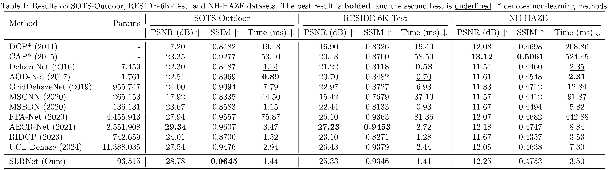

## SLRNet: Super Lightweight Residual Network for Real-Time Image Dehazing

[](https://www.python.org/downloads/)
[](https://pytorch.org/)
[](LICENSE)
[](https://doi.org/10.5281/zenodo.20051973)

## Introduction

Image dehazing aims to generate haze-free images from hazy observations. While recent deep learning approaches achieve impressive restoration quality, they suffer from excessive computational complexity and model size, hindering practical deployment on resource-constrained edge devices. Lightweight models address this but compromise on dehazing performance.

We propose **SLRNet** (Super Lightweight Residual Network), a high-efficiency-yet-effective end-to-end dehazing architecture that integrates a novel **Adaptive Feature Unit (AFU)** with compact residual blocks. Unlike standard channel attention mechanisms that discard spatial information, AFU employs an asymmetric split strategy to simultaneously preserve local texture details and capture global haze density through context-aware gating.


### Key Highlights

- **Ultra-lightweight**: Only 96.5K parameters
- **Real-time inference**: 1.44 ms per image on RTX 4070 Ti Super
- **Performance**: 28.78 dB PSNR / 0.9645 SSIM on SOTS-Outdoor
- **Strong generalization**: Robust to real-world non-homogeneous haze (NH-HAZE) without domain adaptation
- **Simple & effective**: No complex attention mechanisms, Transformers, or domain adaptation pipelines

## Architecture

SLRNet consists of three main components:

1. **Shallow Feature Extraction**: A single 3×3 convolution projects the input to 32-channel feature space.
2. **Adaptive Feature Unit (AFU)**: Dynamically recalibrates channel-wise features through:
   - **Channel Splitting**: Splits features into two halves; only one half undergoes heavy processing
   - **Context-Aware Gating**: Global average pooling + FC + sigmoid to generate channel attention from full context
   - **Feature Transformation**: Depth-wise + point-wise convolutions with GELU on the processed half
   - **Fusion**: Concatenates transformed and gated halves, restores channels via point-wise convolution
3. **Residual Blocks**: Compact 2-layer Conv-GELU-Conv blocks with skip connections.

```
Input → Conv3×3 → AFU → [ResBlock × N] → AFU → + skip → Conv3×3 → Output
```

## Requirements

```bash
conda create -n slrnet python=3.9
conda activate slrnet
pip install -r requirements.txt
```

### Dependencies

- Python ≥ 3.8
- PyTorch ≥ 2.0
- torchvision
- numpy
- opencv-python
- Pillow
- tqdm
- tensorboard

## Dataset

### Dataset Download

| Dataset | Description | Link |
|---------|-------------|------|
| RESIDE | Synthetic indoor & outdoor | [RESIDE Homepage](https://sites.google.com/view/reside-dehaze-datasets) |
| NH-HAZE | Real-world non-homogeneous haze | [ETH Zurich](https://data.vision.ee.ethz.ch/cvl/ntire20/nh-haze/) |

The model is trained on **RESIDE-6K**, a commonly used subset of 6,000 image pairs sampled from RESIDE-OTS. The paper also evaluates on **NH-HAZE** to test generalization to real non-homogeneous haze.

### Data Preparation

The dataset directory is expected to contain `GT/` and `hazy/` subdirectories (matching the official RESIDE format):

```
data/
├── RESIDE-6K/
│   └── train/
│       ├── GT/          # Ground truth (clear) images
│       └── hazy/        # Hazy input images
├── SOTS/
│   └── outdoor/
│       ├── GT/
│       └── hazy/
└── NH-HAZE/
    ├── GT/
    └── hazy/
```

## Training

### Quick Start

```bash
python main.py --mode train --train_root ./data/RESIDE-6K/train/
```

### Monitoring

Training progress can be monitored via TensorBoard:

```bash
tensorboard --logdir logs/
```

## Evaluation

### Quantitative Evaluation

```bash
python test.py --checkpoint checkpoints/best.pth --dataset SOTS
python test.py --checkpoint checkpoints/best.pth --dataset RESIDE-6K
python test.py --checkpoint checkpoints/best.pth --dataset NH-HAZE
```

### Results



### Visual Comparison


## Repository Structure

```
SLRNet/
├── README.md              # This file
├── requirements.txt       # Python dependencies
├── .gitignore            # Git ignore rules
├── LICENSE               # MIT License
├── config.py             # Configuration and hyperparameters
├── train.py              # Training script
├── test.py               # Evaluation script
├── models/
│   ├── __init__.py
│   ├── slrnet.py         # SLRNet architecture
│   └── afu.py            # Adaptive Feature Unit
├── data/
│   ├── __init__.py
│   └── dataset.py        # Data loading and preprocessing
├── losses/
│   ├── __init__.py
│   └── loss.py           # Multi-component loss functions
├── utils/
│   ├── __init__.py
│   ├── crop.py           # PDF cropping utility
│   ├── pdfToimg.py       # PDF to image converter
│   └── size.py           # PDF dimension checker
├── assets/
│   ├── architecture.png  # Network architecture diagram
│   ├── visual_comparison.png  # Visual comparison figure
│   └── ...
├── figures/              # Additional result figures
└── checkpoints/          # Pre-trained model weights (download link)
```

## Acknowledgements

- We thank the authors of [RESIDE](https://sites.google.com/view/reside-dehaze-datasets) [1] and [NH-HAZE](https://data.vision.ee.ethz.ch/cvl/ntire20/nh-haze/) [2] for the benchmark datasets.
- This work was partially supported by Yunnan Fundamental Research Projects (grant No. 202401CF070189) and the National Natural Science Foundation of China (62566064).
> [1]
> ```
> @ARTICLE{li2021benchmarking,
>   	author={Li, Boyi and Ren, Wenqi and Fu, Dengpan and Tao, Dacheng and Feng, Dan and Zeng, Wenjun and Wang, Zhangyang},
>   	journal={IEEE Transactions on Image Processing}, 
>   	title={Benchmarking Single-Image Dehazing and Beyond}, 
>   	year={2019},
>   	volume={28},
>   	number={1},
>   	pages={492-505},
>   	doi={10.1109/TIP.2018.2867951}
> }
> ```

> [2]
> ```
> @INPROCEEDINGS{ancuti2020nhhaze,
>   	author    = {C. O. Ancuti and C. Ancuti and R. Timofte},
>   	title     = {{NH-HAZE}: An Image Dehazing Benchmark with Non-Homogeneous Hazy and Haze-Free Images},
>   	booktitle = {2020 {IEEE/CVF} Conference on Computer Vision and Pattern 	Recognition Workshops},
>   	year      = {2020},
>   	pages     = {1798--1805},
>   	doi       = {10.1109/CVPRW50498.2020.00230},
> }
> ```

## Citations

This paper has been accepted by  [ICIC 2026](http://www.ic-icc.cn/2026/). If you find this work helpful, please cite:

```
@inproceedings{qu2026slrnet,
  title={SLRNet: Super Lightweight Residual Network for Real-Time Image Dehazing},
  author={Qu, Guanheng and Jiang, Fan and Liu, Jiangming},
  journal={},
  year={2026},
  address={Toronto, Canada},
  month={July},
  url={},
  doi = {},
  note={Accepted for publication},
}
```
or
```
@software{Qu_SLRNet_2026,
  author = {Qu, Guanheng and Fan, Jiang and Liu, Jiangming},
  doi = {10.5281/zenodo.20051973},
  month = may,
  title = {{SLRNet}},
  url = {https://github.com/Unk1ndledAC/SLRNet},
  version = {1.0.0},
  year = {2026}
}
```

## License

This project is licensed under the MIT License — see the [LICENSE](LICENSE) file for details.
