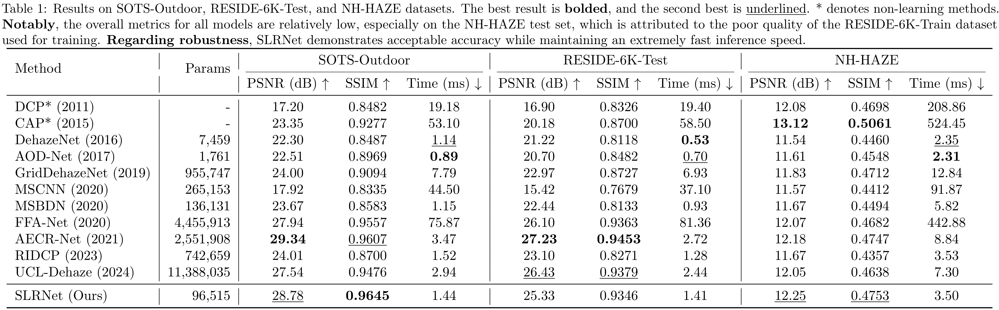

# SLRNet: Super Lightweight Residual Network for Real-Time Image Dehazing

## 1.Overview
- This repo provides a light-weight, end-to-end image dehazing network.




## 2.Installation
```bash
# Python 3.10+ and CUDA 12.4 recommended
pip install -r requirements.txt
```

## 3.Usage
1. Specify the training-set and test-set path.
```bash
# train & test
python -m SLRNet
```

## 4.Citation
This paper has been accepted as a **Poster** at **ICIC 2026** ([Link](http://www.ic-icc.cn/2026/)).
```
@inproceedings{qu2026slrnet,
  title={SLRNet: Super Lightweight Residual Network for Real-Time Image Dehazing},
  author={Guanheng Qu and Fan Jiang and Jiangming Liu},
  journal={Poster Volume I The 2026 Twenty-Second International Conference on Intelligent Computing July 22-26, 2026 Toronto, Canada},
  year={2026},
  address={Toronto, Canada},
  month={July},
  url={},
  note={Accepted for publication (Poster)},
}
```


